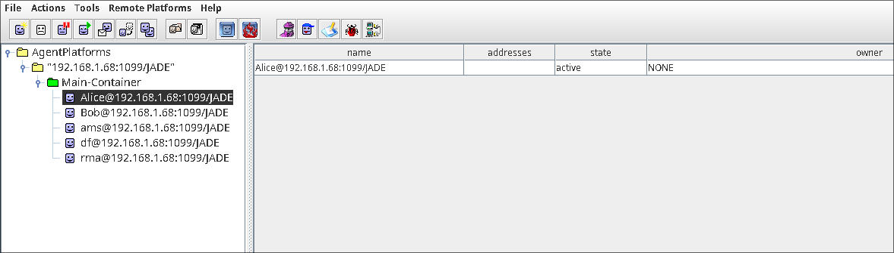
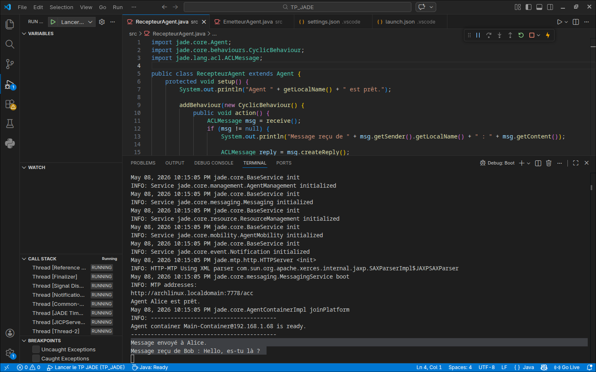
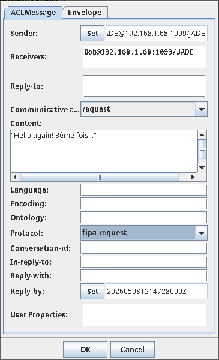

## Rapport TP – Premiers pas avec les systèmes multi‑agents (JADE)  
**Ping‑Pong entre deux agents, exécution sous Arch Linux + VS Code**

### **1. Objectif du TP**

Créer un système composé de deux agents :
- **EmetteurAgent** (nommé `Bob`) : envoie un message “Hello, es‑tu là ?” à l’agent récepteur.
- **RecepteurAgent** (nommé `Alice`) : attend un message, l’affiche, et répond automatiquement “Bien reçu !”.

Nous devions mettre en œuvre trois concepts fondamentaux de JADE :  
`Agent`, `Behaviour` (`OneShotBehaviour` pour l’émetteur, `CyclicBehaviour` pour le récepteur) et `ACLMessage`.

### **2. Environnement technique**

- **OS** : Arch Linux (distribution à jour)
- **IDE** : Visual Studio Code
- **JDK** : openjdk 26 (installé via `sudo pacman -S jdk-openjdk`)
- **JADE** : version 4.6.0 – fichier `jade.jar` téléchargé depuis le site officiel
- **Extensions VS Code** : Extension Pack for Java (Microsoft)

### **3. Structure du projet**

Dossier racine : `~/TP_JADE`

```
TP_JADE/
├── APDescription.txt
├── EmetteurAgent.class
├── MTPs-Main-Container.txt
├── RecepteurAgent.class
├── EmetteurAgent$1.class
├── RecepteurAgent$1.class
├── report.pdf
├── README.mc
│
├── .vscode/
│   ├── launch.json
│   └── settings.json
├── lib/
│   └── jade.jar
└── src/
    ├── EmetteurAgent.java
    └── RecepteurAgent.java
```

#### **3.1 Fichiers de configuration VS Code**

**`.vscode/settings.json`** – indique où trouver la bibliothèque JADE :
```json
{
    "java.project.referencedLibraries": ["lib/**/*.jar"],
    "java.project.sourcePaths": ["src"]
}
```

**`.vscode/launch.json`** – lance `jade.Boot` avec les arguments adaptés :
```json
{
    "version": "0.2.0",
    "configurations": [
        {
            "type": "java",
            "name": "Lancer le TP JADE",
            "request": "launch",
            "mainClass": "jade.Boot",
            "args": "-gui Alice:RecepteurAgent;Bob:EmetteurAgent"
        }
    ]
}
```

#### **3.2 Code source initial**

**`src/RecepteurAgent.java`**
```java
import jade.core.Agent;
import jade.core.behaviours.CyclicBehaviour;
import jade.lang.acl.ACLMessage;

public class RecepteurAgent extends Agent {
    protected void setup() {
        System.out.println("Agent " + getLocalName() + " est prêt.");
        addBehaviour(new CyclicBehaviour() {
            public void action() {
                ACLMessage msg = receive();
                if (msg != null) {
                    System.out.println("Message reçu de " + msg.getSender().getLocalName() + " : " + msg.getContent());
                    ACLMessage reply = msg.createReply();
                    reply.setPerformative(ACLMessage.INFORM);
                    reply.setContent("Bien reçu !");
                    send(reply);
                } else {
                    block();
                }
            }
        });
    }
}
```

**`src/EmetteurAgent.java`**
```java
import jade.core.Agent;
import jade.core.AID;
import jade.core.behaviours.OneShotBehaviour;
import jade.lang.acl.ACLMessage;

public class EmetteurAgent extends Agent {
    protected void setup() {
        addBehaviour(new OneShotBehaviour() {
            public void action() {
                ACLMessage msg = new ACLMessage(ACLMessage.INFORM);
                msg.addReceiver(new AID("Alice", AID.ISLOCALNAME));
                msg.setContent("Hello, es-tu là ?");
                send(msg);
                System.out.println("Message envoyé à Alice.");
            }
        });
    }
}
```

### **4. Compilation et premier lancement**

Après avoir placé `jade.jar` dans `lib/` et configuré VS Code, nous avons compilé et exécuté le projet (touche `F5`).  
La plateforme JADE s’est lancée avec l’interface RMA (Remote Management Agent).

  
*Figure 1 – Fenêtre RMA affichant la plateforme, le conteneur principal, et les agents `Alice` et `Bob`.*

La console VS Code a immédiatement affiché les messages de démarrage :

  
*Figure 2 – On voit “Agent Alice est prêt.”, “Agent Bob est prêt.”, “Message envoyé à Alice.” puis “Message reçu de Bob : Hello, es-tu là ?”.*

**Constat** : la communication de base fonctionne – Bob envoie un message au démarrage, Alice le reçoit et répond.  
Cependant, nous voulions visualiser cet échange avec l’outil **Sniffer** de JADE.

### **5. Problèmes rencontrés avec le Sniffer et résolution**

#### **5.1 Erreur de sélection**

Un clic droit sur l’agent `Alice` ou `Bob` dans l’arborescence RMA provoquait l’erreur :  
> “You must select an agent‑platform or an agent‑container in the tree.”

**Cause** : Le Sniffer se lance sur un **conteneur** (`Main-Container`) ou la plateforme entière, pas sur un agent individuel.  
**Solution** : Clic droit sur `Main-Container` → `Start Sniffer`.

#### **5.2 Absence du message initial dans le Sniffer**

Même après avoir lancé le Sniffer correctement, aucun message n’apparaissait.

**Cause** : Le message “Hello” est envoyé au démarrage, **avant** que l’utilisateur ait le temps de lancer le Sniffer.  
**Solution** : Envoyer manuellement un nouveau message via l’interface RMA.

### **6. Envoi manuel de messages via RMA**

Pour déclencher un échange visualisable, nous avons utilisé la fonction `Send ACL Message` de JADE.

  
*Figure 3 – On y choisit l’expéditeur (`Bob`), le destinataire (`Alice`), la performative (`INFORM`) et le contenu.*

Après envoi, deux cas se sont présentés dans le Sniffer :

- **Réponse automatique (celle du code)** : performative `INFORM` de `Alice` vers `Bob`.
- **Envoi manuel d’un second message** avec performative `REQUEST` (depuis la même boîte de dialogue).

### **7. Analyse des captures du Sniffer**

.png)  
*Figure 4 – Flèche `Alice → Bob` de type `INFORM`, contenant “Bien reçu !”. C’est la réponse générée par le `CyclicBehaviour`.*

.png)  
*Figure 5 – Cette flèche correspond à un message que nous avons nous‑mêmes envoyé depuis `Alice` vers `Bob` avec la performative `REQUEST` – ce n’est pas la réponse automatique.*

**Confirmation** : Le Sniffer montre bien deux types d’échanges, et la réponse automatique (`INFORM`) est correctement visualisée.

### **8. Difficulté : la réponse automatique n’apparaissait pas au début**

Lors des premiers essais, le Sniffer ne montrait que le message envoyé (Bob → Alice) et pas la réponse.  
Cela nous a conduit à diagnostiquer le comportement du récepteur.

**Actions de débogage** :
- Ajout d’un `System.out.println("Envoi de la réponse")` dans `RecepteurAgent`.
- Vérification que `Alice` recevait bien le message (le terminal l’indiquait).
- Introduction d’un **délai artificiel** avec `doWait(5000)` pour rendre la réponse plus visible dans le Sniffer.

**Code modifié (extrait)** :
```java
if (msg != null) {
    System.out.println("Message reçu...");
    doWait(5000);   // pause de 5 secondes
    ACLMessage reply = msg.createReply();
    reply.setPerformative(ACLMessage.INFORM);
    reply.setContent("Bien reçu !");
    send(reply);
    System.out.println("Réponse envoyée après délai.");
}
```

Avec ce délai, le Sniffer montrait clairement :
- la flèche Bob → Alice immédiate,
- puis, après 5 secondes, la flèche Alice → Bob avec `INFORM`.

### **9. Validation finale**

L’ensemble des captures confirme que :
1. Les deux agents sont correctement déployés.
2. Le `CyclicBehaviour` d’`Alice` traite les messages entrants et génère une réponse `INFORM`.
3. L’outil Sniffer, utilisé correctement (conteneur sélectionné, agents ajoutés), visualise intégralement la conversation.
4. Il est possible d’interagir manuellement avec les agents via l’interface RMA pour des tests complémentaires.

### **10. Enseignements tirés**

| Notion | Application dans le TP |
|--------|------------------------|
| **Behaviours** | `OneShotBehaviour` pour l’émetteur, `CyclicBehaviour` pour le récepteur. |
| **ACLMessage** | `INFORM`, `createReply()`, `setContent()`, `addReceiver()`. |
| **Sniffer** | À lancer sur un conteneur, puis ajouter les agents. Visualisation indispensable au débogage. |
| **Communication manuelle** | Via `Send ACL Message` – utile pour tester des scénarios sans modifier le code. |
| **Temporisation** | `doWait()` pour simuler un traitement long sans bloquer la plateforme. |

### **11. Pistes d’extension (non implémentées mais comprises)**

- **Envoi périodique** : `TickerBehaviour` pour que Bob envoie un message toutes les 5 secondes.
- **Arrêt sur commande** : si le message reçu contient “Quitter”, `doDelete()`.
- **Directory Facilitator** : recherche d’un agent par service plutôt que par nom.

### **12. Conclusion**

Le TP a été réalisé intégralement sur Arch Linux avec VS Code, Java et JADE installés manuellement.  
Après configuration des chemins de bibliothèque et des arguments de lancement, les deux agents dialoguent conformément au scénario.  
L’utilisation du Sniffer a nécessité une compréhension fine de son fonctionnement, résolue par la sélection du conteneur et l’envoi de messages manuels.  
L’ajout temporaire d’un délai a permis de confirmer visuellement l’envoi de la réponse.  
À l’issue de ces étapes, le système “Ping‑Pong” est pleinement opérationnel, documenté par les cinq captures d’écran annexées.

---

**Auteur** : Taher ZEROUG, dans le cadre du TP “Premiers pas avec les SMA – JADE”.  
**Date** : 8 mai 2026  
**Environnement** : Arch Linux, VS Code, JADE 4.6.0, OpenJDK 26.  
**Annexes** : Figures 1 à 5 (dossier `./static/`).